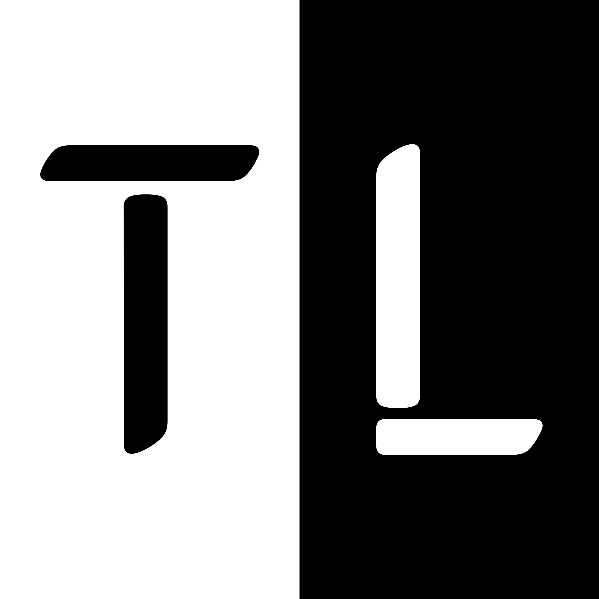

# Welcome to TechnoLuc Documentation!

Create a branded static site from a set of Markdown files to host the documentation of your Open Source or commercial project.

Explore our documentation categories:

## Bash
- [Bash Introduction](bash/index.md)
- [bashrc Configuration](bash/bashrc.md)
- [Bash Extended Cheatsheet](bash/cheatsheet.md)
- [For.. Loops in Bash](bash/loops.md)
- [Bash Scripts](bash/scripts.md)
- [Useful Bash Commands](bash/useful_commands.md)

## Docker
- [Docker Overview](docker/index.md)
- [Docker CLI](docker/docker-cli.md)
- [Docker Compose](docker/docker-compose.md)

## Gists
- [TechnoLuc's Gists](https://gist.github.com/technoluc/starred)

## Hardware
- [Hardware Overview](hardware/index.md)
- [BIOS Keys](hardware/bioskeys.md)
- [Understanding RAM](hardware/ram.md)

## iOS
- [iOS Overview](ios/index.md)
- [Move to iOS Guide](ios/move.md)

## Links
- [CSS-Tricks](https://css-tricks.com)
- [Daily.dev](https://app.daily.dev/)
- [DevDocs](https://devdocs.io)
- [Readme.so](https://readme.so)
- [Resume.io](https://resume.io)

## Linux
- [Linux Overview](linux/index.md)
- [Setting Hostname](linux/set-hostname.md)
- [Networking in Linux](linux/networking.md)
- [NFS Configuration](linux/nfs.md)
- [Sed Commands](linux/sed.md)
- [Setting Timezone](linux/set-timezone.md)

## macOS
- [macOS Overview](macos/index.md)
- [Defaults Collection](macos/collection.md)
- [Useful macOS Scripts](macos/macos-scripts.md)
- [macOS Shortcuts](macos/macos-shortcuts.md)
- [VSCode Shortcuts on macOS](macos/vscode-macos-shortcuts.md)

## Markdown
- [Markdown Overview](markdown/index.md)
- [Markdown Cheatsheet 1](markdown/markdown-cheat-sheet.md)
- [Markdown Cheatsheet 2](markdown/markdown-cheatsheet.md)
- [MkDocs Documentation](mkdocs/index.md)

## Office
- [Office Overview](office/index.md)
  - **Excel:**
    - [Addresses in Excel](office/excel/addresses.md)
    - [Formulas in Excel](office/excel/formulas.md)
  - **Outlook:**
    - [Outlook Modern Auth](office/outlook/outlook-modern-auth.md)

## Proxmox
- [Proxmox Overview](proxmox/index.md)
- [Proxmox Container (CT)](proxmox/ct.md)
- [Proxmox Notes](proxmox/notes.md)
- [Proxmox Virtual Machine (VM)](proxmox/vm.md)

## Python
- [Python Overview](python/index.md)
- [Virtual Environment in Python](python/virtualenv.md)

## Windows
- [Windows Overview](windows/index.md)
- [Activate Office 2021](windows/office.md)
- [Activate Windows 10/11](windows/windows.md)
- [Useful Windows Apps](windows/apps.md)
- [Nirsoft Utilities](windows/nirsoft.md)
- [Working with System Path](windows/path.md)
- [PowerShell Commands](windows/pwsh.md)
- [Printer Configuration](windows/printers.md)
- [Remote Desktop (RDP) Tips](windows/rdp.md)
- [SFC (System File Checker)](windows/sfc.md)
- [Windows Package Manager (WinGet)](windows/winget.md)
- [Reset a Forgotten Windows Administrator Password](windows/admin.md)

Feel free to explore and discover the wealth of knowledge we have documented for you! If you have any questions or need assistance, don't hesitate to ask.

Check out our [GitHub Repository](https://github.com/technoluc/technoluc.github.io) for the latest updates and to contribute.
